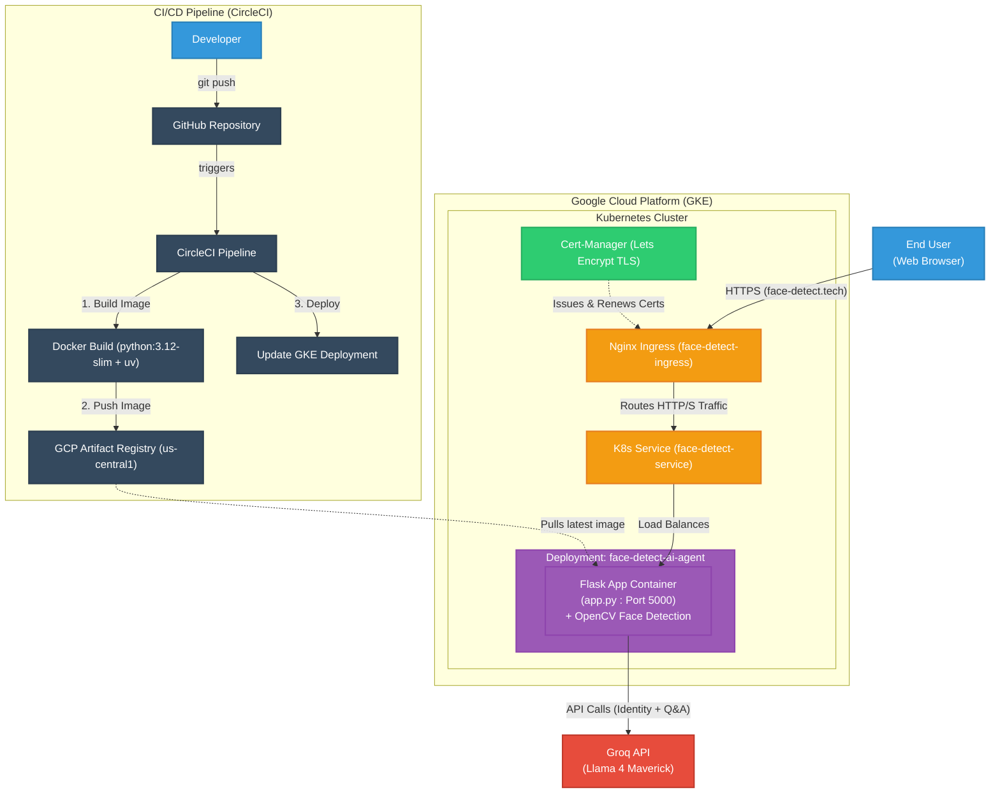

# 🌟 Celebrity Face Detect AI Agent

**Live:** [https://face-detect.tech](https://face-detect.tech)

A Flask web application that detects celebrity faces in uploaded images using OpenCV and identifies them using the Groq AI API. Users can also ask questions about the detected celebrity.

## What It Does

- Upload any photo
- Detects the face using OpenCV (draws a green box around it)
- Identifies the celebrity using Groq's Llama 4 AI model
- Shows info: Name, Profession, Nationality, Famous For, Top Achievements
- Ask follow-up questions about the celebrity via Q&A
- Saves Q&A history in your browser

## Tech Stack

| Layer | Technology |
|-------|-----------|
| Backend | Python, Flask |
| Face Detection | OpenCV (Haar Cascade) |
| AI / LLM | Groq API (Llama 4 Maverick) |
| Package Manager | uv |
| Containerization | Docker |
| Orchestration | Kubernetes (GKE) |
| CI/CD | CircleCI |
| Cloud | Google Cloud Platform (GCP) |

## Project Structure

```
face-detect-ai-agent/
├── app/
│   ├── __init__.py          # Flask app factory
│   ├── routes.py            # URL routes and request handling
│   └── utils/
│       ├── celebrity_detector.py   # Groq API — identifies celebrity
│       ├── image_handler.py        # OpenCV — detects face in image
│       └── qa_engine.py            # Groq API — answers questions
├── templates/
│   └── index.html           # Frontend UI
├── static/
│   └── style.css            # Styling
├── app.py                   # Entry point
├── Dockerfile               # Docker build config
├── cluster-issuer.yaml      # K8s Cert-Manager Let's Encrypt config
├── ingress.yaml             # K8s Nginx Ingress routing
├── kubernetes-deployment.yaml  # K8s deployment + service
├── pyproject.toml           # Project dependencies
└── .circleci/
    └── config.yml          # CI/CD pipeline
```

## Architecture Workflow



## Run Locally

**1. Clone the repo:**

```bash
git clone https://github.com/farhanrhine/Celebrity-Face-Detect-AI-Agent.git
cd face-detect-ai-agent-gcp
```

**2. Create a `.env` file:**

```
GROQ_API_KEY=your_groq_api_key_here
SECRET_KEY=your_secret_key_here
```

**3. Install dependencies and run:**

```bash
uv sync
uv run app.py
```

**4. Open your browser:** `http://localhost:5000`

## Run with Docker

```bash
docker build -t face-detect-ai-agent .
docker run -p 5000:5000 --env-file .env face-detect-ai-agent
```

## Environment Variables

| Variable | Description |
|----------|-------------|
| `GROQ_API_KEY` | Your Groq API key from [console.groq.com](https://console.groq.com) |
| `SECRET_KEY` | Flask secret key (any random string) |

## Deployment

This project is deployed on **Google Kubernetes Engine (GKE)** with an automated **CircleCI** pipeline.

Every `git push` to `main` automatically:

1. Builds a Docker image
2. Pushes it to GCP Artifact Registry
3. Deploys to GKE

**CircleCI Environment Variables required:**

- `GCLOUD_SERVICE_KEY` — Raw JSON content of your GCP service account key
- `GOOGLE_PROJECT_ID` — Your GCP project ID
- `GKE_CLUSTER` — Your GKE cluster name
- `GOOGLE_COMPUTE_REGION` — GCP region (e.g. `us-central1`)
